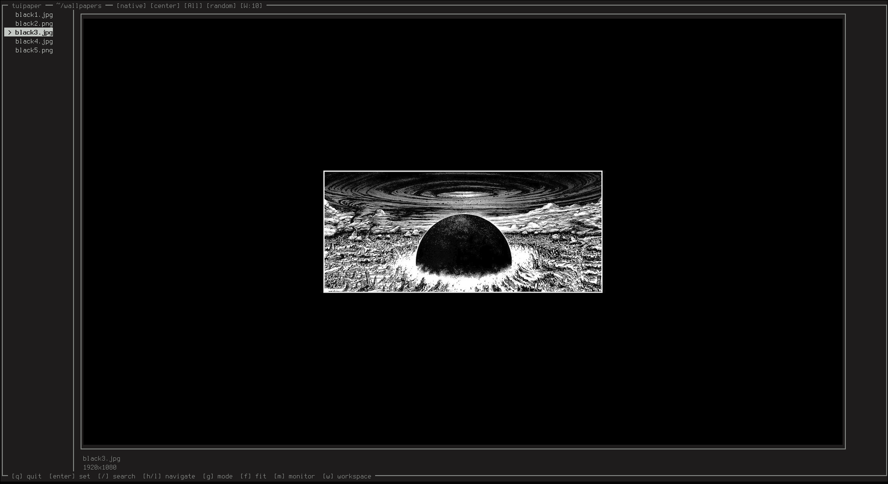

# tuipaper
tuipaper is a simple terminal based wallpaper picker for wayland. 

# installation 
```
git clone https://github.com/aethstetic/tuipaper.git
cd tuipaper
makepkg -si
```

# features
* per workspace wallpapers
* IPC for wallpaper switches.

# requirements 
* a terminal that supports image rendering such as kitty or wezterm.

# information 
* for persistent wallpapers after shutting down I recommend putting `exec-once = tuipaper` in your hyprland config.
* tuipaper has some command line arguments `--disable-color`, `--accent <hex>`,`--interval <minutes>`

# showcase

